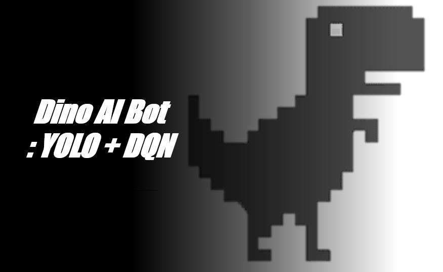
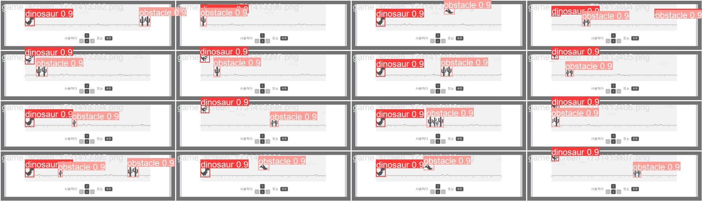
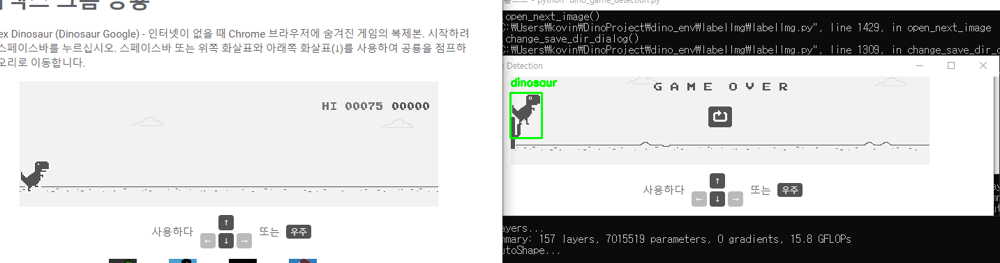

# 🦖 Dino AI Bot: YOLO + DQN 기반 크롬 공룡 게임 자동화

크롬 오프라인 공룡 게임을 인공지능이 스스로 학습하고 플레이합니다.  
YOLOv5로 공룡과 장애물을 실시간 탐지하고, DQN(Deep Q-Learning)으로 게임 상황에 맞는 행동을 학습하여 점프하거나 웅크릴 수 있습니다.

---

## 📸 시연 이미지 (Demo)

> ✅ YOLOv5 탐지 + DQN 자동 플레이 예시

  
_YOLOv5 모델 검증 결과 – 공룡과 장애물을 정확히 탐지_

  
_게임 화면에서 공룡과 장애물을 실시간으로 탐지하는 모습_

  
_공룡이 학습을 통해 점차 장애물을 피하는 모습을 보여줍니다._

---

## 💡 주요 기능 요약

- [x] YOLOv5를 통한 공룡/장애물 객체 탐지
- [x] 게임 화면 실시간 캡처
- [x] PyAutoGUI로 점프/수그리기 자동 조작
- [x] DQN 기반 강화학습 수행
- [x] 보상 기반 학습 및 로그 저장

---

---

## 📘 프로젝트 설명

### 🧠 학습 목표

- 공룡이 장애물을 인식하고, 최적의 행동(점프, 수그리기, 대기)을 선택하여  
  **자동으로 게임을 플레이**할 수 있도록 강화학습을 수행합니다.

### 🧩 객체 감지 (YOLOv5)

- Chrome Dinosaur 게임에서 캡처한 화면을 기반으로  
  공룡과 장애물을 인식하는 객체 감지 모델을 YOLOv5로 학습했습니다.
- 훈련된 `best.pt` 모델을 이용해 실시간으로 화면에서 객체를 탐지합니다.

### 🤖 심층 강화 학습 (DQN)

- **에이전트**: 공룡 캐릭터
- **환경**: Chrome Dinosaur 게임
- **행동**: 대기(0), 점프(1), 수그리기(2)

#### 📈 보상 체계

- 장애물을 넘으면 +1의 보상
  - 연속으로 장애물을 피할수록 보상이 누적되어 학습 효율이 증가
- 장애물에 충돌하거나 게임 오버 시 -10의 감점
  - 에이전트가 충돌을 피하도록 유도함

#### 🛑 게임 오버 감지 방식

- 공룡이 장애물에 충돌하여 **게임 오버**가 되면, `-10`의 감점이 주어집니다.
- 게임 오버 상태는 화면 상단에 표시되는 **“GAME OVER” 이미지**를 기반으로 감지됩니다.

> 템플릿 매칭 방식: `game_over_image.png`를 OpenCV로 화면에서 비교 분석하여  
> 유사도가 일정 수치 이상이면 게임 오버로 판단합니다.

#### 🎯 탐험률(ε) 감소

- 에이전트는 초기에는 무작위로 행동을 많이 시도하지만,
- 학습이 진행될수록 **탐험률(ε)**이 점차 감소하여 **더 최적의 행동**을 선택하도록 유도됩니다:

  - 초기값: 1.0
  - 최소값: 0.01
  - 감소율: 매 학습마다 `0.995`씩 곱해 감소

#### 강화학습 구조 요약

- **Q-함수 근사**: 현재 상태에서의 행동 가치를 예측
- **Experience Replay**: 과거 경험을 무작위 샘플링하여 학습 안정화
- **Target Network**: 일정 주기마다 타깃 네트워크 업데이트
- **에피소드 단위 학습**: 게임이 끝날 때까지 1 에피소드로 구성

---

## 🎯 프로젝트 목표

- Chrome Dinosaur 게임에서 공룡과 장애물을 인식하고  
  강화학습을 통해 공룡이 장애물을 회피하며 500점 이상의 점수를 달성하는 것

> ❗️ _현재 프로젝트는 진행 중이며 지속적인 개선이 예정되어 있습니다._

---

## 🧭 사용 순서 개요

1. ✅ YOLOv5로 공룡과 장애물을 학습하거나, `best.pt` 모델 사용
2. ✅ 학습된 모델을 이용해 객체 탐지 테스트
3. ✅ DQN 에이전트가 감지된 객체를 기반으로 학습을 수행

---

## 🛠 기술 스택

- **YOLOv5**: 객체 탐지 (공룡 / 장애물)
- **PyTorch**: 강화학습 모델 구현 (DQN)
- **OpenCV**: 화면 처리 및 게임 오버 감지
- **PyAutoGUI**: 게임 조작 자동화
- **Selenium**: Chrome 게임 페이지 자동 실행

---

## 📁 프로젝트 구조

    dino-ai-bot/
    ├── main/                  # 강화학습 및 실행 코드
    ├── yolo_training/         # YOLO 학습 관련 코드 및 데이터
    │   ├── images/            # 학습 이미지
    │   ├── labels/            # YOLO 라벨
    │   ├── best.pt            # 학습된 모델
    │   ├── data.yaml          # YOLO 학습 설정
    ├── data/
    │   └── game_over_image.png
    ├── docs/                  # 시연 이미지
    ├── dino_env/
    │   └── chromedriver-win64/  # (사용자 직접 설치)
    ├── requirements.txt
    └── README.md

---

## 📦 사전 준비

1. **Chrome 설치**
   - [크롬 설치 링크](https://www.google.com/chrome/)
2. **ChromeDriver 설치**
   - 버전에 맞는 [ChromeDriver 다운로드](https://chromedriver.chromium.org/downloads)
   - `dino_env/chromedriver-win64/`에 `chromedriver.exe` 위치

---

## ⚙️ 설치 방법

가상환경 생성 (선택):

    python -m venv dino_env
    source dino_env/bin/activate  # or dino_env\Scripts\activate

필수 패키지 설치:

    pip install -r requirements.txt

YOLOv5 설치 (최초 1회):

    git clone https://github.com/ultralytics/yolov5
    pip install -r yolov5/requirements.txt

---

## 🧠 사용 방법

### 1️⃣ YOLO 학습 (선택사항)

YOLOv5를 사용해 공룡과 장애물을 학습하려면 아래 명령어를 실행하세요:

    cd yolov5
    python train.py --img 640 --batch 16 --epochs 50 --data ../yolo_training/data.yaml --weights yolov5s.pt --project runs/train --name exp --cache

> ⚠️ 주의: 위 명령어로 학습을 수행해야 `yolov5/runs/train/exp4/weights/best.pt` 경로가 생성됩니다.  
> 만약 학습을 생략하고 결과만 확인하고 싶다면, **제공된 `best.pt` 파일을 수동으로 아래 경로에 넣어주세요**:

    yolov5/runs/train/exp4/weights/best.pt

> 폴더가 없다면 수동으로 만들어주세요.

---

### 2️⃣ YOLO 탐지 결과 확인

    python yolo_training/dino_game_detection.py

> 실행된 화면에서 공룡과 장애물을 실시간으로 인식하는 모습을 확인할 수 있습니다.

---

### 3️⃣ 강화학습 실행 (DQN)

    cd main
    python main/dino_game_dqn.py

> 💡 주의: `dino_game_dqn.py` 내부에서 상대 경로(`../logs`, `../models` 등)를 사용하므로,  
> **`main/` 폴더 안에서 실행해야** 에러 없이 작동합니다.

> 💾 학습이 진행되면 다음과 같은 파일이 자동으로 저장됩니다:
>
> - `models/dqn_model_ep{N}.pth` : 에피소드 N 시점의 DQN 모델 가중치
> - `memory/replay_ep{N}.pkl` : 경험 리플레이 메모리
> - `logs/training_log.csv` : 학습 중 에피소드별 보상 및 탐험률 기록
>
> 💾 모델 가중치와 경험 리플레이 메모리는 **10 에피소드마다 한 번씩 저장되며**,  
> 학습 중 에피소드별 보상 및 탐험률은 **매 에피소드마다 로그로 기록됩니다.**

---

## 🙌 개발자

- 👨‍💻 **전우진 (Woojin Jeon)**
- ✉️ [koving11@naver.com](mailto:koving11@naver.com)
- 🔗 [https://github.com/Joycong](https://github.com/Joycong)

---
